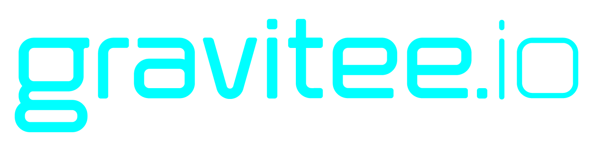
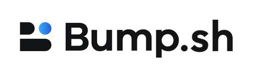
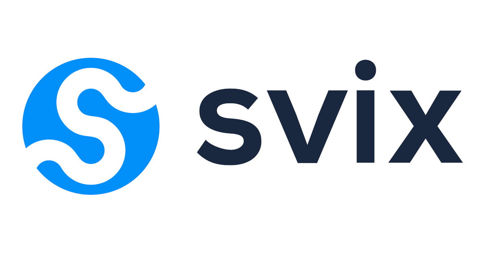
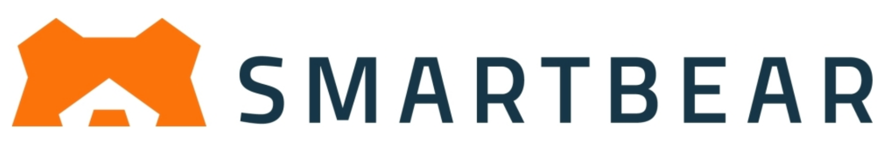

## Read the specification

The latest draft specification can be found at [spec/asyncapi.md](./spec/asyncapi.md) which tracks the latest commit to the master branch in this repository.

**The human-readable markdown file is the source of truth for the specification.**

- [Version 3.1.0](https://github.com/asyncapi/spec/blob/v3.1.0/spec/asyncapi.md) (latest) ([website](https://www.asyncapi.com/docs/reference/specification/latest))

  
Click to see reference links to older versions of the specification.

- [Version 3.0.0](https://github.com/asyncapi/spec/blob/v3.0.0/spec/asyncapi.md)
- [Version 2.6.0](https://github.com/asyncapi/spec/blob/v2.6.0/spec/asyncapi.md)
- [Version 2.5.0](https://github.com/asyncapi/spec/blob/v2.5.0/spec/asyncapi.md)
- [Version 2.4.0](https://github.com/asyncapi/spec/blob/v2.4.0/spec/asyncapi.md)
- [Version 2.3.0](https://github.com/asyncapi/spec/blob/v2.3.0/spec/asyncapi.md)
- [Version 2.2.0](https://github.com/asyncapi/spec/blob/v2.2.0/spec/asyncapi.md)
- [Version 2.1.0](https://github.com/asyncapi/spec/blob/v2.1.0/spec/asyncapi.md)
- [Version 2.0.0](https://github.com/asyncapi/spec/blob/2.0.0/versions/2.0.0/asyncapi.md)
- [Version 1.2.0](https://github.com/asyncapi/spec/blob/1.2.0/README.md) (deprecated)
- [Version 1.1.0](https://github.com/asyncapi/spec/blob/1.1.0/README.md) (deprecated)
- [Version 1.0.0](https://github.com/asyncapi/spec/blob/1.0.0/README.md) (deprecated)

 

Looking for the JSON Schema files? Check out our [spec-json-schemas](https://github.com/asyncapi/spec-json-schemas) repo.

Feel like contributing? Check out our [contributor's guide](./CONTRIBUTING.md).

## Examples

Check out the [examples](https://github.com/asyncapi/asyncapi/blob/master/examples) directory for examples.

## Case Studies and Adopters

Check out the [AsyncAPI website](https://www.asyncapi.com/casestudies) to see the list of AsyncAPI adopters and their use cases.

## Our Sponsors

Want to become a sponsor? Learn [what we do with sponsors' money](https://www.asyncapi.com/finance) and [join the club](https://opencollective.com/asyncapi).

### Platinum

&nbsp;&nbsp;&nbsp;&nbsp;

### Gold

&nbsp;&nbsp;&nbsp;&nbsp;  

### Silver

&nbsp;&nbsp;&nbsp;&nbsp;

 

&nbsp;&nbsp;&nbsp;&nbsp;

 

### Bronze

&nbsp;&nbsp;&nbsp;&nbsp;

## Contributors

Thanks goes to these wonderful people ([emoji key](https://allcontributors.org/docs/en/emoji-key)):

<!-- ALL-CONTRIBUTORS-LIST:START - Do not remove or modify this section -->
<!-- prettier-ignore-start -->
<!-- markdownlint-disable -->
<table>
  <tbody>
    <tr>
      <td align="center" valign="top" width="11.11%"><a href="http://www.fmvilas.com"> <b>Fran Méndez</b></a> <a href="#question-fmvilas" title="Answering Questions">💬</a> <a href="https://github.com/asyncapi/spec/issues?q=author%3Afmvilas" title="Bug reports">🐛</a> <a href="#blog-fmvilas" title="Blogposts">📝</a> <a href="https://github.com/asyncapi/spec/commits?author=fmvilas" title="Documentation">📖</a> <a href="#ideas-fmvilas" title="Ideas, Planning, & Feedback">🤔</a> <a href="#infra-fmvilas" title="Infrastructure (Hosting, Build-Tools, etc)">🚇</a> <a href="#maintenance-fmvilas" title="Maintenance">🚧</a> <a href="https://github.com/asyncapi/spec/pulls?q=is%3Apr+reviewed-by%3Afmvilas" title="Reviewed Pull Requests">👀</a> <a href="#tutorial-fmvilas" title="Tutorials">✅</a> <a href="#talk-fmvilas" title="Talks">📢</a></td>
      <td align="center" valign="top" width="11.11%"><a href="http://resume.github.io/?derberg"> <b>Lukasz Gornicki</b></a> <a href="https://github.com/asyncapi/spec/commits?author=derberg" title="Documentation">📖</a> <a href="#ideas-derberg" title="Ideas, Planning, & Feedback">🤔</a> <a href="https://github.com/asyncapi/spec/pulls?q=is%3Apr+reviewed-by%3Aderberg" title="Reviewed Pull Requests">👀</a> <a href="#question-derberg" title="Answering Questions">💬</a> <a href="#blog-derberg" title="Blogposts">📝</a> <a href="#talk-derberg" title="Talks">📢</a> <a href="#maintenance-derberg" title="Maintenance">🚧</a> <a href="#infra-derberg" title="Infrastructure (Hosting, Build-Tools, etc)">🚇</a></td>
      <td align="center" valign="top" width="11.11%"><a href="http://mermade.github.io"> <b>Mike Ralphson</b></a> <a href="#question-MikeRalphson" title="Answering Questions">💬</a> <a href="https://github.com/asyncapi/spec/commits?author=MikeRalphson" title="Documentation">📖</a> <a href="#ideas-MikeRalphson" title="Ideas, Planning, & Feedback">🤔</a> <a href="#infra-MikeRalphson" title="Infrastructure (Hosting, Build-Tools, etc)">🚇</a> <a href="https://github.com/asyncapi/spec/pulls?q=is%3Apr+reviewed-by%3AMikeRalphson" title="Reviewed Pull Requests">👀</a> <a href="#maintenance-MikeRalphson" title="Maintenance">🚧</a></td>
      <td align="center" valign="top" width="11.11%"><a href="https://github.com/rmelian"> <b>raisel melian</b></a> <a href="#question-rmelian" title="Answering Questions">💬</a> <a href="https://github.com/asyncapi/spec/issues?q=author%3Armelian" title="Bug reports">🐛</a> <a href="https://github.com/asyncapi/spec/commits?author=rmelian" title="Documentation">📖</a> <a href="#ideas-rmelian" title="Ideas, Planning, & Feedback">🤔</a> <a href="#maintenance-rmelian" title="Maintenance">🚧</a> <a href="https://github.com/asyncapi/spec/pulls?q=is%3Apr+reviewed-by%3Armelian" title="Reviewed Pull Requests">👀</a></td>
      <td align="center" valign="top" width="11.11%"><a href="https://github.com/SensibleWood"> <b>Chris Wood</b></a> <a href="#ideas-SensibleWood" title="Ideas, Planning, & Feedback">🤔</a> <a href="https://github.com/asyncapi/spec/commits?author=SensibleWood" title="Documentation">📖</a></td>
      <td align="center" valign="top" width="11.11%"><a href="https://github.com/jschabowsky"> <b>Jonathan Schabowsky</b></a> <a href="https://github.com/asyncapi/spec/commits?author=jschabowsky" title="Documentation">📖</a> <a href="#ideas-jschabowsky" title="Ideas, Planning, & Feedback">🤔</a></td>
      <td align="center" valign="top" width="11.11%"><a href="https://github.com/vromero"> <b>Victor Romero</b></a> <a href="#ideas-vromero" title="Ideas, Planning, & Feedback">🤔</a> <a href="https://github.com/asyncapi/spec/pulls?q=is%3Apr+reviewed-by%3Avromero" title="Reviewed Pull Requests">👀</a></td>
      <td align="center" valign="top" width="11.11%"><a href="http://antoniogarrote.wordpress.com"> <b>Antonio Garrote</b></a> <a href="#ideas-antoniogarrote" title="Ideas, Planning, & Feedback">🤔</a> <a href="https://github.com/asyncapi/spec/pulls?q=is%3Apr+reviewed-by%3Aantoniogarrote" title="Reviewed Pull Requests">👀</a> <a href="https://github.com/asyncapi/spec/commits?author=antoniogarrote" title="Documentation">📖</a></td>
      <td align="center" valign="top" width="11.11%"><a href="https://ramses.tech"> <b>Jonathan Stoikovitch</b></a> <a href="#example-jstoiko" title="Examples">💡</a> <a href="#ideas-jstoiko" title="Ideas, Planning, & Feedback">🤔</a> <a href="https://github.com/asyncapi/spec/pulls?q=is%3Apr+reviewed-by%3Ajstoiko" title="Reviewed Pull Requests">👀</a></td>
    </tr>
    <tr>
      <td align="center" valign="top" width="11.11%"><a href="https://github.com/jonaslagoni"> <b>Jonas Lagoni</b></a> <a href="https://github.com/asyncapi/spec/issues?q=author%3Ajonaslagoni" title="Bug reports">🐛</a> <a href="https://github.com/asyncapi/spec/commits?author=jonaslagoni" title="Documentation">📖</a> <a href="#ideas-jonaslagoni" title="Ideas, Planning, & Feedback">🤔</a> <a href="#question-jonaslagoni" title="Answering Questions">💬</a> <a href="https://github.com/asyncapi/spec/pulls?q=is%3Apr+reviewed-by%3Ajonaslagoni" title="Reviewed Pull Requests">👀</a> <a href="#example-jonaslagoni" title="Examples">💡</a></td>
      <td align="center" valign="top" width="11.11%"><a href="https://waleedashraf.me/"> <b>Waleed Ashraf</b></a> <a href="#talk-WaleedAshraf" title="Talks">📢</a> <a href="#ideas-WaleedAshraf" title="Ideas, Planning, & Feedback">🤔</a> <a href="https://github.com/asyncapi/spec/commits?author=WaleedAshraf" title="Documentation">📖</a> <a href="#example-WaleedAshraf" title="Examples">💡</a></td>
      <td align="center" valign="top" width="11.11%"><a href="https://github.com/jerzyn"> <b>Andrzej Jarzyna</b></a> <a href="#talk-jerzyn" title="Talks">📢</a></td>
      <td align="center" valign="top" width="11.11%"><a href="https://linkedin.com/in/emmelyn"> <b>Emmelyn Wang</b></a> <a href="#blog-lifewingmate" title="Blogposts">📝</a> <a href="#ideas-lifewingmate" title="Ideas, Planning, & Feedback">🤔</a> <a href="https://github.com/asyncapi/spec/commits?author=lifewingmate" title="Documentation">📖</a> <a href="#talk-lifewingmate" title="Talks">📢</a></td>
      <td align="center" valign="top" width="11.11%"><a href="https://marcd.dev"> <b>Marc DiPasquale</b></a> <a href="#blog-Mrc0113" title="Blogposts">📝</a> <a href="#talk-Mrc0113" title="Talks">📢</a> <a href="https://github.com/asyncapi/spec/pulls?q=is%3Apr+reviewed-by%3AMrc0113" title="Reviewed Pull Requests">👀</a> <a href="https://github.com/asyncapi/spec/issues?q=author%3AMrc0113" title="Bug reports">🐛</a> <a href="#ideas-Mrc0113" title="Ideas, Planning, & Feedback">🤔</a> <a href="#video-Mrc0113" title="Videos">📹</a></td>
      <td align="center" valign="top" width="11.11%"><a href="http://www.gerald-loeffler.net/"> <b>Gerald Loeffler</b></a> <a href="https://github.com/asyncapi/spec/commits?author=GeraldLoeffler" title="Documentation">📖</a> <a href="https://github.com/asyncapi/spec/issues?q=author%3AGeraldLoeffler" title="Bug reports">🐛</a> <a href="#ideas-GeraldLoeffler" title="Ideas, Planning, & Feedback">🤔</a></td>
      <td align="center" valign="top" width="11.11%"><a href="http://dalelane.co.uk/"> <b>Dale Lane</b></a> <a href="#blog-dalelane" title="Blogposts">📝</a> <a href="#ideas-dalelane" title="Ideas, Planning, & Feedback">🤔</a> <a href="#video-dalelane" title="Videos">📹</a> <a href="#talk-dalelane" title="Talks">📢</a> <a href="#tutorial-dalelane" title="Tutorials">✅</a> <a href="https://github.com/asyncapi/spec/commits?author=dalelane" title="Documentation">📖</a></td>
      <td align="center" valign="top" width="11.11%"><a href="https://github.com/magicmatatjahu"> <b>Maciej Urbańczyk</b></a> <a href="https://github.com/asyncapi/spec/pulls?q=is%3Apr+reviewed-by%3Amagicmatatjahu" title="Reviewed Pull Requests">👀</a> <a href="#ideas-magicmatatjahu" title="Ideas, Planning, & Feedback">🤔</a> <a href="#question-magicmatatjahu" title="Answering Questions">💬</a> <a href="https://github.com/asyncapi/spec/issues?q=author%3Amagicmatatjahu" title="Bug reports">🐛</a> <a href="https://github.com/asyncapi/spec/commits?author=magicmatatjahu" title="Documentation">📖</a> <a href="#example-magicmatatjahu" title="Examples">💡</a> <a href="#maintenance-magicmatatjahu" title="Maintenance">🚧</a></td>
      <td align="center" valign="top" width="11.11%"><a href="https://vladimirgorej.com/"> <b>Vladimir Gorej</b></a> <a href="https://github.com/asyncapi/spec/commits?author=char0n" title="Documentation">📖</a> <a href="https://github.com/asyncapi/spec/issues?q=author%3Achar0n" title="Bug reports">🐛</a> <a href="#example-char0n" title="Examples">💡</a> <a href="#ideas-char0n" title="Ideas, Planning, & Feedback">🤔</a> <a href="https://github.com/asyncapi/spec/pulls?q=is%3Apr+reviewed-by%3Achar0n" title="Reviewed Pull Requests">👀</a></td>
    </tr>
    <tr>
      <td align="center" valign="top" width="11.11%"><a href="http://www.lornajane.net/"> <b>Lorna Jane Mitchell</b></a> <a href="#talk-lornajane" title="Talks">📢</a> <a href="#ideas-lornajane" title="Ideas, Planning, & Feedback">🤔</a></td>
      <td align="center" valign="top" width="11.11%"><a href="http://medium.com/@lbroudoux"> <b>Laurent Broudoux</b></a> <a href="https://github.com/asyncapi/spec/commits?author=lbroudoux" title="Documentation">📖</a> <a href="#blog-lbroudoux" title="Blogposts">📝</a> <a href="#talk-lbroudoux" title="Talks">📢</a> <a href="#example-lbroudoux" title="Examples">💡</a> <a href="#ideas-lbroudoux" title="Ideas, Planning, & Feedback">🤔</a> <a href="https://github.com/asyncapi/spec/pulls?q=is%3Apr+reviewed-by%3Albroudoux" title="Reviewed Pull Requests">👀</a></td>
      <td align="center" valign="top" width="11.11%"><a href="https://github.com/jmenning-solace"> <b>Jesse Menning</b></a> <a href="#blog-jmenning-solace" title="Blogposts">📝</a> <a href="#talk-jmenning-solace" title="Talks">📢</a> <a href="https://github.com/asyncapi/spec/pulls?q=is%3Apr+reviewed-by%3Ajmenning-solace" title="Reviewed Pull Requests">👀</a> <a href="#ideas-jmenning-solace" title="Ideas, Planning, & Feedback">🤔</a></td>
      <td align="center" valign="top" width="11.11%"><a href="https://github.com/smoya"> <b>Sergio Moya</b></a> <a href="https://github.com/asyncapi/spec/pulls?q=is%3Apr+reviewed-by%3Asmoya" title="Reviewed Pull Requests">👀</a> <a href="#ideas-smoya" title="Ideas, Planning, & Feedback">🤔</a> <a href="#question-smoya" title="Answering Questions">💬</a> <a href="#blog-smoya" title="Blogposts">📝</a> <a href="https://github.com/asyncapi/spec/issues?q=author%3Asmoya" title="Bug reports">🐛</a> <a href="https://github.com/asyncapi/spec/commits?author=smoya" title="Documentation">📖</a> <a href="#example-smoya" title="Examples">💡</a> <a href="#maintenance-smoya" title="Maintenance">🚧</a></td>
      <td align="center" valign="top" width="11.11%"><a href="https://github.com/balogal"> <b>Alexander Balogh</b></a> <a href="https://github.com/asyncapi/spec/commits?author=balogal" title="Documentation">📖</a> <a href="https://github.com/asyncapi/spec/issues?q=author%3Abalogal" title="Bug reports">🐛</a></td>
      <td align="center" valign="top" width="11.11%"><a href="https://github.com/KhudaDad414"> <b>Khuda Dad Nomani</b></a> <a href="#example-KhudaDad414" title="Examples">💡</a> <a href="https://github.com/asyncapi/spec/issues?q=author%3AKhudaDad414" title="Bug reports">🐛</a></td>
      <td align="center" valign="top" width="11.11%"><a href="https://github.com/aaronkorver"> <b>Aaron Korver</b></a> <a href="https://github.com/asyncapi/spec/commits?author=aaronkorver" title="Documentation">📖</a></td>
      <td align="center" valign="top" width="11.11%"><a href="https://github.com/xunto"> <b>Orlov Valentine</b></a> <a href="https://github.com/asyncapi/spec/commits?author=xunto" title="Documentation">📖</a></td>
      <td align="center" valign="top" width="11.11%"><a href="https://lejenome.tik.tn"> <b>Moez Bouhlel</b></a> <a href="https://github.com/asyncapi/spec/commits?author=lejenome" title="Documentation">📖</a></td>
    </tr>
    <tr>
      <td align="center" valign="top" width="11.11%"><a href="https://github.com/luphieanza"> <b>Muhammad Rafly Andrianza</b></a> <a href="https://github.com/asyncapi/spec/commits?author=luphieanza" title="Documentation">📖</a></td>
      <td align="center" valign="top" width="11.11%"><a href="https://danielkocot.github.io/"> <b>Daniel Kocot</b></a> <a href="https://github.com/asyncapi/spec/commits?author=danielkocot" title="Documentation">📖</a> <a href="#example-danielkocot" title="Examples">💡</a> <a href="#ideas-danielkocot" title="Ideas, Planning, & Feedback">🤔</a></td>
      <td align="center" valign="top" width="11.11%"><a href="https://github.com/sekharbans-ebay"> <b>sekharbans-ebay</b></a> <a href="https://github.com/asyncapi/spec/commits?author=sekharbans-ebay" title="Documentation">📖</a> <a href="#example-sekharbans-ebay" title="Examples">💡</a> <a href="#ideas-sekharbans-ebay" title="Ideas, Planning, & Feedback">🤔</a></td>
      <td align="center" valign="top" width="11.11%"><a href="http://www.damaru.com/"> <b>Michael Davis</b></a> <a href="https://github.com/asyncapi/spec/issues?q=author%3Adamaru-inc" title="Bug reports">🐛</a> <a href="https://github.com/asyncapi/spec/commits?author=damaru-inc" title="Documentation">📖</a> <a href="#example-damaru-inc" title="Examples">💡</a> <a href="#ideas-damaru-inc" title="Ideas, Planning, & Feedback">🤔</a></td>
      <td align="center" valign="top" width="11.11%"><a href="https://github.com/GreenRover"> <b>Heiko Henning</b></a> <a href="https://github.com/asyncapi/spec/issues?q=author%3AGreenRover" title="Bug reports">🐛</a> <a href="https://github.com/asyncapi/spec/commits?author=GreenRover" title="Code">💻</a> <a href="#content-GreenRover" title="Content">🖋</a> <a href="https://github.com/asyncapi/spec/commits?author=GreenRover" title="Documentation">📖</a> <a href="#example-GreenRover" title="Examples">💡</a> <a href="#ideas-GreenRover" title="Ideas, Planning, & Feedback">🤔</a> <a href="#maintenance-GreenRover" title="Maintenance">🚧</a> <a href="https://github.com/asyncapi/spec/pulls?q=is%3Apr+reviewed-by%3AGreenRover" title="Reviewed Pull Requests">👀</a></td>
      <td align="center" valign="top" width="11.11%"><a href="http://www.docsasecosystem.com"> <b>Quetzalli </b></a> <a href="#content-alequetzalli" title="Content">🖋</a> <a href="https://github.com/asyncapi/spec/commits?author=alequetzalli" title="Documentation">📖</a> <a href="#example-alequetzalli" title="Examples">💡</a> <a href="#ideas-alequetzalli" title="Ideas, Planning, & Feedback">🤔</a> <a href="https://github.com/asyncapi/spec/pulls?q=is%3Apr+reviewed-by%3Aalequetzalli" title="Reviewed Pull Requests">👀</a></td>
      <td align="center" valign="top" width="11.11%"><a href="https://github.com/akkshitgupta"> <b>Akshit Gupta</b></a> <a href="#content-akkshitgupta" title="Content">🖋</a> <a href="https://github.com/asyncapi/spec/commits?author=akkshitgupta" title="Documentation">📖</a></td>
      <td align="center" valign="top" width="11.11%"><a href="https://amzani.com/"> <b>samz</b></a> <a href="https://github.com/asyncapi/spec/issues?q=author%3AAmzani" title="Bug reports">🐛</a> <a href="#content-Amzani" title="Content">🖋</a> <a href="https://github.com/asyncapi/spec/commits?author=Amzani" title="Documentation">📖</a> <a href="#example-Amzani" title="Examples">💡</a> <a href="#projectManagement-Amzani" title="Project Management">📆</a></td>
      <td align="center" valign="top" width="11.11%"><a href="http://rishikaushik.com"> <b>Rishi</b></a> <a href="#maintenance-kaushik-rishi" title="Maintenance">🚧</a> <a href="#infra-kaushik-rishi" title="Infrastructure (Hosting, Build-Tools, etc)">🚇</a></td>
    </tr>
    <tr>
      <td align="center" valign="top" width="11.11%"><a href="https://github.com/nickshoe"> <b>nickshoe</b></a> <a href="https://github.com/asyncapi/spec/issues?q=author%3Anickshoe" title="Bug reports">🐛</a> <a href="https://github.com/asyncapi/spec/commits?author=nickshoe" title="Documentation">📖</a></td>
      <td align="center" valign="top" width="11.11%"><a href="https://github.com/AceTheCreator"> <b>Ace </b></a> <a href="#eventOrganizing-AceTheCreator" title="Event Organizing">📋</a> <a href="#ideas-AceTheCreator" title="Ideas, Planning, & Feedback">🤔</a> <a href="#maintenance-AceTheCreator" title="Maintenance">🚧</a> <a href="#talk-AceTheCreator" title="Talks">📢</a></td>
      <td align="center" valign="top" width="11.11%"><a href="https://github.com/AnimeshKumar923"> <b>Animesh Kumar</b></a> <a href="#content-AnimeshKumar923" title="Content">🖋</a> <a href="https://github.com/asyncapi/spec/commits?author=AnimeshKumar923" title="Documentation">📖</a> <a href="#maintenance-AnimeshKumar923" title="Maintenance">🚧</a></td>
      <td align="center" valign="top" width="11.11%"><a href="https://lazzaretti.me/"> <b>Fabrizio Lazzaretti</b></a> <a href="https://github.com/asyncapi/spec/commits?author=Lazzaretti" title="Documentation">📖</a></td>
      <td align="center" valign="top" width="11.11%"><a href="https://www.linkedin.com/in/pavel-bo/"> <b>Pavel Bodiachevskii</b></a> <a href="https://github.com/asyncapi/spec/commits?author=Pakisan" title="Documentation">📖</a> <a href="https://github.com/asyncapi/spec/issues?q=author%3APakisan" title="Bug reports">🐛</a> <a href="#ideas-Pakisan" title="Ideas, Planning, & Feedback">🤔</a> <a href="#question-Pakisan" title="Answering Questions">💬</a></td>
    </tr>
  </tbody>
</table>

<!-- markdownlint-restore -->
<!-- prettier-ignore-end -->

<!-- ALL-CONTRIBUTORS-LIST:END -->

This project follows the [all-contributors](https://github.com/all-contributors/all-contributors) specification. Contributions of any kind welcome!
