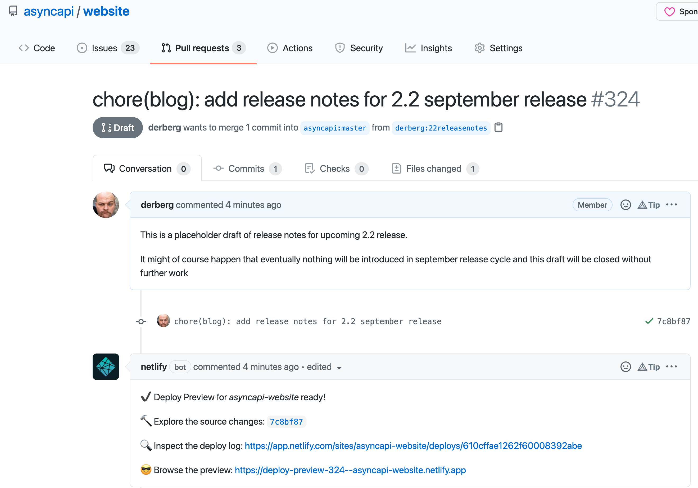

# Release Process of the AsyncAPI Specification

This document is meant to explain the release process of the AsyncAPI specification. It aims to describe all details of the process so that any member of the community can jump in and help coordinate.

It covers:
- **[Who?](#who)** - who is responsible for doing what in a release
- **[When?](#when)** - when releases happen
- **[What?](#what)** - what is covered by this document
- **[How?](#how)** - a description of the steps needed for a release

---
## Who?

### "Release coordinator"

AsyncAPI specification release involves not only spec release but also the release of AsyncAPI-maintained tools. Therefore it requires a single person called `release coordinator` to ensure the release goes well throughout all phases. The release coordinator is responsible for working through the process described below.

The release coordinator doesn't have to do all the work alone. The release coordinator needs to find the right people to do the work required for a given phase and engage as many people as needed.

Each release can have a different release coordinator. If you are interested and would like to know more, [join our Slack workspace](https://www.asyncapi.com/slack-invite) and visit the `11_how-to-contribute` channel.

### Code owners

Many of the steps needed to release a new version of the AsyncAPI specification (e.g. merging, creating branches, creating releases) need support from administrators for individual github.com/asyncapi repositories.

Each repository contains a `CODEOWNERS` file (e.g. https://github.com/asyncapi/parser-js/blob/master/CODEOWNERS) that identifies the people who can help.

---
## When?

### Release cadence

AsyncAPI releases happen regularly in the following months:
- January
- April
- June
- September

Regular releases concern only major and minor releases. We do not decide up front if the next release is major or minor. This decision depends on the proposals for changes in the specification and how much they affect specification and tooling in a given release cycle.

Patch releases are automatically released and published.

### Release date philosophy

The release is scheduled for a given month, not a specific day. We will release once everything is ready, and won't wait until the last day of the month with the release.

We release often, so anything that isn't ready can wait until the next release (e.g. it can be released in June if the change will not make it in April). Our priority is the quality, and not quantity, of the features. Quality means that changes for a release is properly delivered in as many tools as possible with very good documentation and examples.

---
## What?

### Repositories

Github repositories that need to be updated at the same time to enable a release, in a coordinated way, are:
- [spec](https://github.com/asyncapi/spec) - the specification file
- [spec-json-schemas](https://github.com/asyncapi/spec-json-schemas) - the JSON schema
- [parser-js](https://github.com/asyncapi/parser-js) - the JavaScript parser
- [website](https://github.com/asyncapi/website) - the website

---
## How?

The steps described here are not intended to be strictly chronological. For a single release, it might make sense to start some pieces of work in a slightly different order. The intention of the steps here is meant to give release coordinators a rough idea of the sequence involved.

### Step 1 - kick off call

A nice way to start a new release is to do one or more of the initial steps on an open live call/meeting.

This isn't a required step, but possible benefits include:
- raising awareness of the upcoming release
- giving a new release coordinator support and initial direction to help them get started
- allowing potential future release coordinators to see what is involved

Examples of arranging a contribution call like this can be found in the [community repository](https://github.com/asyncapi/community/issues?q=is%3Aissue+label%3Ameeting+contributor-first+)

### Step 2 - create a release issue

To allow the community to see what is currently being considered for inclusion in a release, and to give easy, at-a-glance visibility over the progress, create a new Github issue in the [spec](https://github.com/asyncapi/spec) repository.

This issue should be updated as each of the following steps are completed.

A [template for a new release issue](https://github.com/asyncapi/spec/blob/master/.github/ISSUE_TEMPLATE/release.md) is available.

An example is the [release issue for the 2.3.0](https://github.com/asyncapi/spec/issues/675) release.

### Step 3 - update release branches

Release branches should be present in the following repositories:

- [spec](https://github.com/asyncapi/spec) where contributor works with the specification file,
- [spec-json-schemas](https://github.com/asyncapi/spec-json-schemas) where contributor pushes changes to JSON Schema of the spec,
- [parser-js](https://github.com/asyncapi/parser-js) where contributor makes necessary changes in the JavaScript Parser.
 
Depending on the type of release you are working on, you should use one branch or another:

- `next-spec`: for releasing minor versions. For example, `2.3.0` to `2.4.0`.
- `next-major-spec`: for releasing major versions. For example, `2.4.0` to `3.0.0`.

Once you know which branch you should use, there are some initial changes that need to be made.

The process for doing this is the same for each of these:
- the [release coordinator](#%22release-coordinator%22) should create a fork, if not created yet, of the relevant repository for these changes.
- the [release coordinator](#%22release-coordinator%22) should ensure the chosen **release branch** is up-to-date with the **default branch** (normally `master`) before adding any changes.
- the commit message for the change should start with `chore:`
- the change should be contributed in a pull request targeting the chosen **release branch**. 
- the [release coordinator](#%22release-coordinator%22) will need to ask the [code owners](#code-owners) for the relevant repository to approve and merge this pull request

#### Step 3.1 - Update version numbers in official examples
Repository: [spec](https://github.com/asyncapi/spec)

Examples are located in the `examples/` folder in the [spec](https://github.com/asyncapi/spec) repository. They should all be updated to the new version number.

An example of doing this is:
- this [commit from the 2.3.0 release](https://github.com/dalelane/spec/commit/8c521539cd875470ea8e89cf3ab7ffd81be64788)
- this [pull request from the 2.3.0 release](https://github.com/asyncapi/spec/pull/676)

#### Step 3.2 - Update version number in the spec
Repository: [spec](https://github.com/asyncapi/spec)

References to the latest version in `spec/asyncapi.md` should be updated to the new version number.

Examples of doing this are:
- this [commit from the 2.3.0 release](https://github.com/asyncapi/spec/commit/1f29d803ca801756d4ea3f676bcf7e7751478de6)
- this [commit from the 2.3.0 release](https://github.com/asyncapi/spec/commit/7f827a880fa3ddcbc9a39d50e41502bc450443bc)

#### Step 3.3 - Add new reference to the latest spec version in README
The new release should be listed in the [README.md](README.md) file and marked as `(latest)`.

An example of doing this is:
- this [commit from the 2.3.0 release](https://github.com/asyncapi/spec/pull/710/commits/22ba6c433ddbeeeda38f5aed55708826da62cf70)

#### Step 3.4 - Create a new JSON schema file for the new version
Repository: [spec-json-schemas](https://github.com/asyncapi/spec-json-schemas)

To create a new version, please read [Creating a new version](https://github.com/asyncapi/spec-json-schemas#creating-a-new-version).

It should be named with the version of the new release, and a link should be added to the `index.js` file (in the same repository).

An example of doing this is:
- this [commit from the 3.0.0 release](https://github.com/asyncapi/spec-json-schemas/pull/221/files)
- this [pull request from the 3.0.0 release](https://github.com/asyncapi/spec-json-schemas/pull/221)

#### Step 3.5 - Update the list of AsyncAPI schema MIME types with the new version
Repository: [parser-js](https://github.com/asyncapi/parser-js)

The file to be updated is `lib/asyncapiSchemaFormatParser.js` in the [parser-js](https://github.com/asyncapi/parser-js) repository.

The new version number should be added to the list in the `getMimeTypes` function.

An example of doing this is:
- this [pull request from the 2.3.0 release](https://github.com/asyncapi/parser-js/pull/426)

### Step 4 - prepare announcement blog post

Each new release is announced by a blog post. You can see all of these at https://www.asyncapi.com/blog?tags=Release+Notes

The [release coordinator](#%22release-coordinator%22) should create an empty placeholder blog post that can be added to by different contributors to the release throughout the release process.

The steps to follow for this are:
- Create a fork of the [website](https://github.com/asyncapi/website) repository
- Create a new file at `pages/blog/release-notes-X.X.X.md` (replacing `X.X.X` with the version number for the release)
- Add a standard header at the top of the file (see the release notes for [2.2.0](https://raw.githubusercontent.com/asyncapi/website/master/pages/blog/release-notes-2.2.0.md) and [2.3.0](https://raw.githubusercontent.com/asyncapi/website/master/pages/blog/release-notes-2.3.0.md) for examples)
- Add a (webp format) cover image to the `public/img/posts/release-notes-X.X.X/` folder, and update the `cover` attribute of the blog post header with it. (**Make sure to attribute the image correctly** - unsplash.com is a good source of free images for this). See [this commit from the 2.3.0 release](https://github.com/asyncapi/website/pull/512/commits/4050ca0540684f5188300e0c27efc713a6ba1ec2) for an example of doing this.
- Add a (webp format) profile picture of the release coordinator to the `public/img/avatars` folder, and update the `authors` attribute of the blog post header with it. See [this commit from the 2.3.0 release](https://github.com/asyncapi/website/pull/512/commits/006f7df26b0d0803ed2e1dd6b8004dfdaec15617) for an example of doing this.
- Open a **draft** pull request against the [website](https://github.com/asyncapi/website/) repository. Make sure the option **Allow edits and access to secrets by maintainers** is selected to enable support from maintainers.

An example of doing this is:
- this [pull request from the 2.3.0 release](https://github.com/asyncapi/website/pull/512)

### Step 5 - create pull requests

Pull requests should be opened for all [repositories covered by this process](#repositories).

These should be full, not draft, pull requests to allow automated tests to run.

They should point from the [release branches](#step-3---create-release-branches) to the default/master branches for each repository.

Add a **do-not-merge** label to the pull request by making a comment in the PR saying `/dnm`.
Add a **autoupdate** label to the pull request by making a comment in the PR saying `/au`.

_Note: The automation bot will keep the release branch up to date with the latest commits from the master branch (so long as there are no conflicts)._

### Step 6 - bring updates into release branch

The [release coordinator](#%22release-coordinator%22) should help to seek out possible updates that are good candidates for including in the release.

There are lots of ways to do this:
- ask for contributions in [Slack](https://www.asyncapi.com/slack-invite)
- ask for suggestions at a [community meeting](https://github.com/asyncapi/community/issues?q=is%3Aissue+is%3Aopen+label%3Ameeting)
- look for open accepted issues (see the [contribution guide](CONTRIBUTING.md) for a description of the requirements for a proposal to reach `Stage 3: Accepted`)
- look for open pull requests in the [repositories covered by this process](#repositories)

For each feature that is being brought into the release, a pull request should be created from the feature branch (the branch with the accepted changes in) to the [release branch](#step-3---create-release-branches).

Pull requests must be:
- labeled as an accepted proposal,
- created against the feature branch,
- created in all repositories specified in contribution guide

### Step 7 - update announcement blog post

As features are identified for inclusion in the release, the [draft announcement blog post](#step-6---prepare-announcement-blog-post) should be updated with descriptions of them. The [release cooordinator](#%22release-coordinator%22) should coordinate with the feature contributors to write a description of each change. They should be able to provide input and also be allowed to work as co-authors for the release notes post.

Changes in the specification need to be well described. We need clear information on what has changed, why, and who contributed to the change. The purpose of the announcement blog post is to be a more user-friendly alternative to a regular changelog.

Every feature added to the [release branch](#step-3---create-release-branches) needs to be properly described in the release notes post.

### Step 8 - prepare release notes

In addition to the [announcement blog post](#step-9---update-announcement-blog-post), the [release coordinator](#%22release-coordinator%22) should prepare release notes for each of the [repositories covered by this process](#repositories).

These should:
- be written in markdown
- include a list of features and significant changes
- include a link to github issues and pull requests where more background can be found
- include a link to a github diff with the previous release

Examples of doing this are:
- the [release notes for version 2.3.0 of spec](https://github.com/asyncapi/spec/releases/tag/v2.3.0)

### Step 9 - notify people the release is coming

As the release gets closer to being ready, it is helpful to remind the community that the release is on the way.

A good way to do this is to mention code owners and community tool maintainers in the [release issue](#step-2---create-a-release-issue) to draw their attention to it.

This can also be done:
- in the `#specification` channel in [Slack](https://www.asyncapi.com/slack-invite)
- at [community meetings](https://github.com/asyncapi/community/issues?q=is%3Aissue+is%3Aopen+label%3Ameeting)

Including a link to the [release issue](#step-2---create-a-release-issue) is a good way to let the community see the progress that has been made so far.

### Step 10 - reviews

At least one [code owner](#code-owners) must approve the [release pull requests](#step-7---create-pull-requests) in all related [repositories](#repositories).

### Step 11 - release candidates

Pre-release release candidates are generated automatically by the automation bot when:
- a pull request with a **fix** or **feat** prefix in the title is merged into the [release branch](#step-3---create-release-branches)

An example of a pull request created by the automation bot is: https://github.com/asyncapi/spec-json-schemas/pull/151 

Release candidates will include:
- upcoming release number
- date of the release
- release candidate number

An example release candidate is: https://github.com/asyncapi/spec/releases/tag/v2.3.0-2022-01-release.3

**Important:** When release candidates are created for the [spec](https://github.com/asyncapi/spec) repository, the [parser-js](https://github.com/asyncapi/parser-js) repository will need to be updated to use that release candidate. 

### Step 12 - Notify code owners of critical repositories about the pre-releases

In order to let code owners of critical repositories have enough time to work on the changes needed on tooling, the [release coordinator](#%22release-coordinator%22) should notify code owners about the pre-releases.
As per today, the following repositories are considered critical:

- [HTML Template](https://github.com/asyncapi/html-template)
- [JavaScript Converter](https://github.com/asyncapi/converter-js/)
- [React component](https://github.com/asyncapi/asyncapi-react/)
- [Studio](https://github.com/asyncapi/studio)

### Step 13 - merge the release branches

Once everything is ready, it is time to merge the [release branches](#step-3---create-release-branches) using the [draft pull requests prepared earlier](#step-7---create-pull-requests).

Merging can only be done by [code owners](#code-owners).

Pull requests must have a `feat: ` prefix that, after the merge, produces a release candidate with a minor version update. The major version must have `feat!: ` prefix.

Pull requests in the `parser-js` can be merged only if it uses the release candidate of `@asyncapi/specs` package produced after merge of a pull request in `spec-json-schemas`.

First, changes are merged into the `spec` repository, then `spec-json-schemas` and then in `parser-js`.

Release means merge of pull requests created from a release branch against the master branch. First, changes are merged into the `spec` repository, then `spec-json-schemas` and at the end in `parser-js`. Like in the case of the merge of release candidates, a pull request in `parser-js` can be merged only if it uses the final release of the new `@asyncapi/specs` package.

### Step 14 - publish releases

The [release coordinator](#%22release-coordinator%22) should ask the [code owners](#code-owners) for each repository to update the release in Github created by the automation bot, by adding the [release notes they have prepared](#step-10---prepare-release-notes).

### Step 15 - notify tool maintainers

Our current CI/CD automation will fill PR's updating the dependencies **automatically** on all repositories after the release. 
However, the [release coordinator](#%22release-coordinator%22) should notify maintainers of the dependant repositories that a new release happened, as those might want to adopt the new features. 

Some of the dependant repositories are:
  - [Avro Schema parser](https://github.com/asyncapi/avro-schema-parser)
  - [Bundler](https://github.com/asyncapi/bundler)
  - [CLI](https://github.com/asyncapi/cli)
  - [Cupid](https://github.com/asyncapi/cupid)
  - [Dot Net NATS template](https://github.com/asyncapi/dotnet-nats-template)
  - [Generator](https://github.com/asyncapi/generator)
  - [Generator React SDK](https://github.com/asyncapi/generator-react-sdk)
  - [Glee](https://github.com/asyncapi/glee)
  - [HTML Template](https://github.com/asyncapi/html-template)
  - [Java Template](https://github.com/asyncapi/java-template)
  - [JavaScript Converter](https://github.com/asyncapi/converter-js/)
  - [Markdown template](https://github.com/asyncapi/markdown-template)
  - [Modelina](https://github.com/asyncapi/modelina)
  - [NodeJS WS Template](https://github.com/asyncapi/nodejs-ws-template)
  - [Optimizer](https://github.com/asyncapi/optimizer)
  - [Parser Go](https://github.com/asyncapi/parser-go)
  - [React component](https://github.com/asyncapi/asyncapi-react/)
  - [Server API](https://github.com/asyncapi/server-api/)
  - [Simulator](https://github.com/asyncapi/simulator)
  - [Studio](https://github.com/asyncapi/studio)
  - [TS NATS Template](https://github.com/asyncapi/ts-nats-template)

You can use Github Code Search to find the [list of repositories depending on parser-js or the specs](https://cs.github.com/?scopeName=All+repos&scope=&q=org%3Aasyncapi+%28path%3Apackage.json+OR+go.mod%29+%22%40asyncapi%2Fparser%22+OR+%22%40asyncapi%2Fspecs%22+OR+%22github.com%2Fasyncapi%2Fspec-json-schemas%22+OR+%22github.com%2Fasyncapi%2Fparser-go%22#). 
Alternatively, you can use the following GH search queries:
- [NodeJS @asyncapi/specs dependants](https://github.com/search?q=org%3Aasyncapi+in%3Afile+filename%3Apackage.json+%22%40asyncapi%2Fspecs%22)
- [NodeJS @asyncapi/parser dependants](https://github.com/search?q=org%3Aasyncapi+in%3Afile+filename%3Apackage.json+%22%40asyncapi%2Fparser%22)
- [Go github.com/asyncapi/spec-json-schemas dependants](https://github.com/search?q=org%3Aasyncapi+in%3Afile+filename%3Ago.mod+%22%40github.com%2Fasyncapi%2Fspec-json-schemas%22)
- [Go github.com/asyncapi/parser-go dependants](https://github.com/search?q=org%3Aasyncapi+in%3Afile+filename%3Ago.mod+%22%40github.com%2Fasyncapi%2Fparser-go%22)

You can check the following [example of notification to maintainers](https://github.com/asyncapi/spec/issues/735#issuecomment-1109801674).

The [release coordinator](#%22release-coordinator%22) should also make sure other maintainers from other projects under the AsyncAPI GitHub organization released their packages.

### Step 16 - notify the community

Every release of the release candidate is automatically published on the AsyncAPI Twitter account and in the releases-dedicated Slack channel.

If the [release coordinator](#%22release-coordinator%22) uses social networks like Twitter or LinkedIn, it is a great idea for them to promote the work that they've done to prepare the release by announcing it on their own private accounts. These can then be promoted and shared from the official AsyncAPI social accounts, to highlight and demonstrate the community-driven nature of releases. 

Feel free to use other communication channels. Make sure that as many people as possible know about the change. Feel free to contact vendors upfront or other people that are interested in changes in the specification.

### Step 17 - improve the release process

Every release identifies new issues and ways that the process can be improved.

Once the release is complete, the final step is to update this document with anything that could have gone better!
