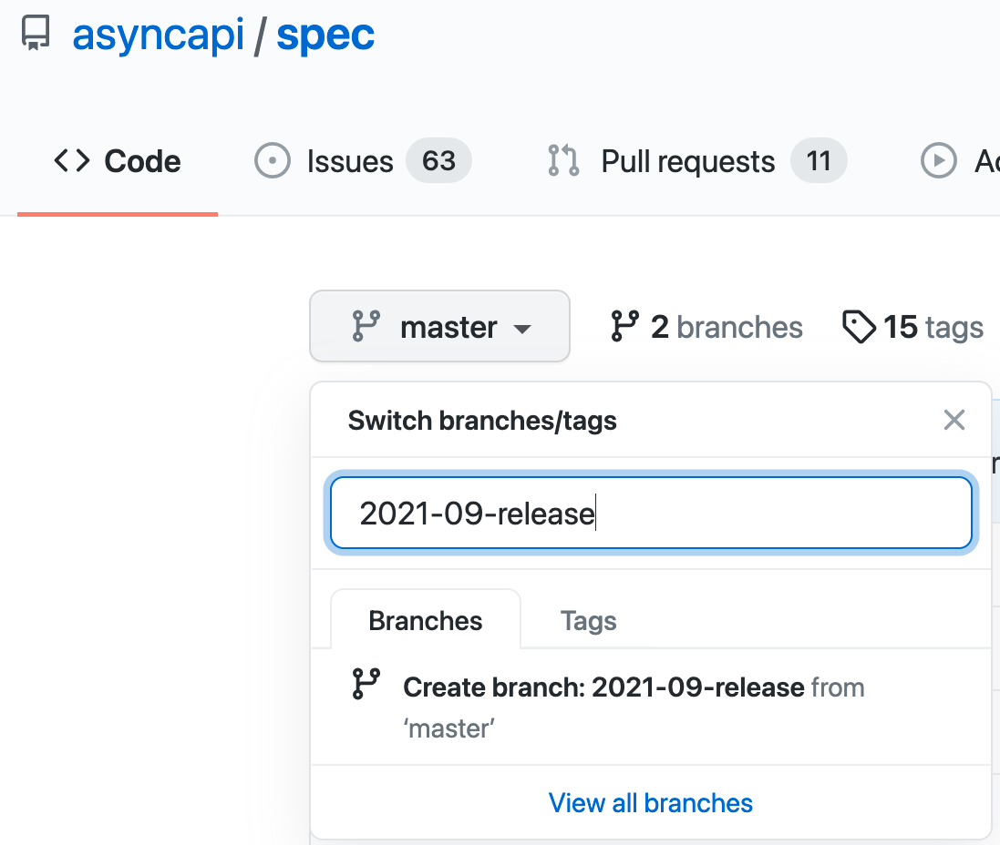

# Release Process of the AsyncAPI Specification

This document is meant to explain the release process of the AsyncAPI specification. This document aims to describe all details of the process so that any member of the community can jump in and help coordinate.

## Release coordinator

AsyncAPI specification release involves not only spec release but also the release of AsyncAPI-maintained tools. Therefore it requires a single person called `release coordinator` to ensure the release goes well throughout all phases.

The release coordinator doesn't have to do all the work alone. The release coordinator needs to find the right people to do the work required for a given phase and engage as many people as needed.

## Release cadence

AsyncAPI releases happen regularly in the following months:
- January
- April
- June
- September

Regular releases concern only major and minor releases. We do not decide upfront if the next release is major or minor. This decision depends on the proposals for changes in the specification and how much they affect specification and tooling in a given release cycle.

Patch releases are automatically released and published.

## Release phases

### Kick off

We start by creating release branches and a placeholder for release notes in the AsyncAPI Blog.

#### Release branch

At the beginning of the release cycle, we need to have a new release branch created in some repositories. The reason is that [contribution guide](https://github.com/asyncapi/spec/blob/master/CONTRIBUTING.md) for the specification requires changes in different projects to get a proposal accepted. The following repositories are involved:
- [spec](https://github.com/asyncapi/spec) where contributor works with the specification file,
- [spec-json-schemas](https://github.com/asyncapi/spec-json-schemas) where contributor pushes changes to JSON Schema of the spec,
- [parser-js](https://github.com/asyncapi/parser-js) where contributor makes necessary changes in the JavaScript Parser.

Release branch must have a year and a month of the release as prefix: {YEAR_OF_RELEASE}-{MONTH_OF_RELEASE}-release. For example, a release created in September 2021 has a `2021-09-release` release branch.

#### Release notes

Changes in the specification need to be well described. We need clear information on what has changed, why, and who contributed to the change. A simple changelog is not enough as it is not user-friendly. Every release must have release notes.

A draft pull request with release notes must be opened at the same time release branches are created. Work on release notes should be done on a feature-by-feature basis and not at the end of the release cycle. Cooperate with contributors. They should be able to provide input and also be allowed to work as release notes article co-authors.

In other words, once a feature is introduced in the release branch, make sure it is properly described in release notes.

The draft pull request must be opened against the [Website](https://github.com/asyncapi/website/) repository. Make sure the option `Allow edits and access to secrets by maintainers` is selected to enable support from maintainers.

### Review and merge 

TODO: proposal phases, who reviews/accepts/merges, what are prerequisites for the merge, what happens after the merge. Remember about updating release notes on issue by issue case to not have it at the end of the release cycle. What about tooling updates? release candidates? After first merge we should already have draft PR to master opened in all required repos

### Ship it!

TODO: what needs to be done in json schema repo, what in parser repo. How to trigger release, when merge release notes, who to inform, social networks, communication, beer or wine!

