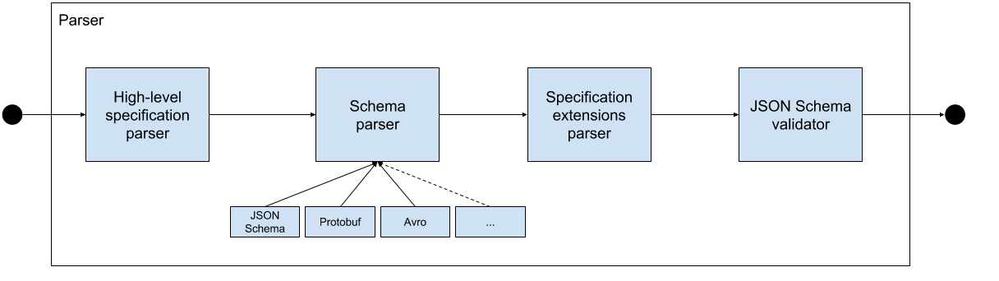

# THIS IS A WORK IN PROGRESS

This document describes the tentative roadmap for AsyncAPI tooling in the next ~6 months and the strategies we'll follow to create the tools.

## Roadmap
We want to start developing tools as we make progress with version 2.0.0. To minimize the impact of future specification changes in the tools (_just those for v2 while it's in development_), we'll perform [all the breaking changes of the spec](https://github.com/asyncapi/asyncapi/issues?utf8=%E2%9C%93&q=label%3A%22v2+breaking+change%22+) first, and then we'll start with tooling **development**. Notice I've used the word _development_ because I want to make it clear that we can start other types of work beforehand, like planning, architecting, documenting the approach, etc. Actually, this document is already a pre-development work.

### Milestones

#### :arrow_right: Create a Parser/Validator
The first tool we would have to implement is the AsyncAPI parser/validator. The parser/validator is a core piece of all the other tooling we'll build in the future. Therefore it's a top priority for us.

##### Requirements:
1. It MUST support YAML and JSON as input formats.
2. It MUST support the following schema formats: OpenAPI schemas, JSON Schema Draft 04-07, Protobuf, and Avro.
3. It MUST support plugging in a new format parser.
4. It MUST be implemented as a Go package and [exported as a C shared object](https://medium.com/learning-the-go-programming-language/calling-go-functions-from-other-languages-4c7d8bcc69bf).
5. It MUST have wrappers in the following languages: Java and Node.js.

#### :arrow_right: Create code generation framework
1. Design a code generation solution.
2. Keep in mind how to make the code generation solution suitable for documentation generation too. Maybe by improving [asyncapi/generator](https://github.com/asyncapi/generator)?
3. Implement code generation templates for the following languages: Java, Node.js, and Go.

##### Dependencies:
* Parser/Validator

#### :arrow_right: SDKs
Investigate, define requirements, and implement, at least, two SDKs: one for Java <sup>1</sup> and another for Node.js. Ideally, we should find a way to automate the process of creating new SDKs, or to make it as fast and smooth as possible.

##### Suggestions:
* Implement an SDK in Go.
* Create wrappers for other languages.

##### Dependencies:
* Parser/Validator

#### :arrow_right: Implement code generation templates using SDKs
Implement templates in our code generation tool for a simple Java application and a simple Node.js application, both using our SDKs.

##### Dependencies:
* Parser/Validator
* SDKs

#### :arrow_right: Add support for AsyncAPI 2.0.0 in AsyncAPI React component
_Requirements to be discussed with [@derberg](https://github.com/derberg) and the Kyma/SAP team._

##### Suggestions:
* Extract parser implementation to another package.
* Make sure all parser dependencies are compatible with a browser.

##### Dependencies:
* _(none)_

#### :arrow_right: Add support for AsyncAPI 2.0.0 in all [asyncapi/generator](https://github.com/asyncapi/generator) templates
So far, only HTML and Markdown templates will require work.

##### Dependencies:
* _(none)_

#### :arrow_right: Improve online code editor (editor.asyncapi.org)
Most probably this will consist in ditching the current editor in favor of the playground [@derberg](https://github.com/derberg) and the Kyma/SAP team have created.

##### Requirements:
* Add support for multiple documentation formats: React, HTML, and Markdown.
* Add support for multiple schema types: OpenAPI, JSON Schema Draft 04-07, Protobuf, and Avro.
* Add a button to generate and download code (whenever code generators are available).
* Add ability to load a remote file.
* Auto-update documentation as you type.

##### Dependencies:
* AsyncAPI 2.0.0 React, HTML, and Markdown.
* Code generators (this should not be a blocker to deliver an initial version with only documentation features.)

## Strategies
As you may have already noticed, there are three main tooling categories:
1. Parser/Validator
2. SDKs
3. Code and documentation generators

By far, the one that will require more work is the "SDKs" one. Just the fact that we'll have to build all the possible combinations between languages, schema formats, and protocols, makes you quickly realize it's going to be a tedious task. Let's do a quick calculation here: 4 languages (Java, Node.js, Go, and .NET) x 4 schema formats (OpenAPI, JSON Schema Draft 04-07, Protobuf, and Avro) x 5 protocols (AMQP 0-9-1, AMQP 1.0, Kafka, MQTT, WebSockets) = 80 combinations! And I'm keeping the list of languages and protocols short on purpose.

It's no secret we'll have to do ~some~a lot of automation here. But how do we automate all of this? There's the challenge! We're not going to build all of this at once, obviously. Instead, we should follow an incremental approach where we can learn of every step and feed the process back with the learnings to keep improving it.


## Technical proposal
The way I see us succeeding is by creating a pluggable architecture and splitting the work into the following components or plugins.

### Terminology

###### High-level specification parser/validator
This component is in charge of parsing/validating the standard specification. It does not go into details on how to parse schemas. It's sole purpose is to guarantee the AsyncAPI document has the correct structure and provide a beautified version of it.

###### Schema parser
This component must parse the schemas conforming to their type, e.g., JSON Schema Draft 04-07, Protobuf, Avro, OpenAPI schema, etc.

###### Protocol mapper
A protocol mapper is a special type of specification extension. In version 2.0.0, protocol information will be contained in their own specification extension. For instance:

```yaml
...
publish:
  x-mqtt:
    headers:
      qos:
        type: number
        enum: [1,2]
        description: Quality of Service. 0 is forbidden.
    anyProtocolSpecificConfiguration: its value
```

Following the example above, the MQTT protocol mapper will use the `x-mqtt` object to serialize/deserialize a message to/from an MQTT binary message format.

###### Specification extension parsers
An AsyncAPI document may contain custom information provided in the form of [specification extensions](https://github.com/asyncapi/asyncapi/blob/master/versions/1.2.0/asyncapi.md#specificationExtensions). Therefore, a specification extension parser is the piece of software that understands, interprets, and validates the extension.

###### Examples:

```yaml
info:
  x-twitter: '@awesome-user'
```

Or a more complex one:

```yaml
components:
  schemas:
    chatMessage:
      type: object
      properties:
        channel:
          type: string
          x-format: slack-channel # This adds an unsupported vendor-specific format. Notice this field may be parsed by other specification extensions. E.g., a Twitter specification extension may add support for x-format: twitter-handle.
```

### Requirements

#### Parser/Validator



The flow is as follows:

1. The High-level specification parser (HLSP) receives either a YAML or JSON AsyncAPI document. It parses the document and checks if it's valid AsyncAPI. Skips specification extensions and schemas validation. It validation fails, the Parser/Validator should trigger an error. Produces a beautified version of the document in JSON Schema Draft 07.
2. The output of the HLSP serves as the input of the Schema parser, which will in turn identify the type of the schema and will pass it to the appropiate parser. It's the responsiblity of each parser to translate the schema format to valid JSON Schema Draft 07 and return it back to the Schema parser. E.g., Protobuf to JSON Schema Draft 07, Avro to JSON Schema Draft 07, JSON Schema Draft 04 to JSON Schema Draft 07, etc. The Schema parser will replace the original schema definition with the one returned from a specific format parser.
3. The output of the Schema parser serves as the input for the Specification extensions parser (SEP), which will seek for extensions and will pass them to the appropiate parser. It's the responsiblity of each parser to interpret, validate, and return the validation results to the SEP. It validation fails, the Parser/Validator should trigger an error.
4. To finish, we must check the whole document is still valid JSON Schema Draft 07. If it is, the output of the parser must be the JSON Schema document. Otherwise, it should trigger an error.

|Input|Output|Required by|
|-----|------|-----------|
|An AsyncAPI document in YAML or JSON format.| A beautified version of the document in JSON Schema format Draft 07.| Code generators, SDKs, Documentation generators, and potentially every future tool.|

###### Example code

> This code is just for explanation purposes. Please, **do not** take it as an example of how it should be implemented.

```go
import (
    "fmt"

    "github.com/asyncapi/hlsp"
    "github.com/asyncapi/schemaparser"
    "github.com/asyncapi/protojsonschema"
    "github.com/asyncapi/sep"
    "github.com/someone/asyncapiTwitterExtension"
    "github.com/xeipuuv/gojsonschema"
)

func main() {
    // Step 1
    document := `{"asyncapi": "2.0.0", ...}`
    result, err := hslp.Parse(document)
    if err != nil {
        panic(err.Error())
    }

    // Step 2
    result, err := schemaparser.Parse(result, [protojsonschema.Parser])
    if err != nil {
        panic(err.Error())
    }

    // Step 3
    result, err := sep.Parse(result, [asyncapiTwitterExtension])
    if err != nil {
        panic(err.Error())
    }

    // Step 4
    schemaLoader := gojsonschema.NewReferenceLoader("file:///path/to/asyncapi/2.0.0/schema.json")
    documentLoader := gojsonschema.NewStringLoader(document)
    result, err := gojsonschema.Validate(schemaLoader, documentLoader)
    if err != nil {
        panic(err.Error())
    }
}
```

### High-level specification parser/validator

_To be defined._

|Input|Output|Required by|
|-----|------|-----------|
|An AsyncAPI document in YAML or JSON format.| A beautified version of the document in JSON Schema Draft 07 format.| Parser/Validator

### Schema parser

_To be defined._

|Input|Output|Required by|
|-----|------|-----------|
|An AsyncAPI **schema** in YAML or JSON format.| A beautified version of the **schema** in JSON Schema Draft 07 format.| Parser/Validator

### Protocol mapper

_To be defined._

|Input|Output|Required by|
|-----|------|-----------|
|An AsyncAPI protocol mapper definition in YAML or JSON format.| _None_ | SDKs

### Specification extension parser

_To be defined._

|Input|Output|Required by|
|-----|------|-----------|
|An AsyncAPI specification extension in YAML or JSON format.| A resolved version of the specification extension in JSON Schema Draft 07 format.| Parser/Validator

# The end

---
1: Do we really need an SDK for Java? Or are Spring Boot and Spring Cloud Streams enough? Are they very coupled to Spring? i.e., can someone use these libraries without using the Spring framework?